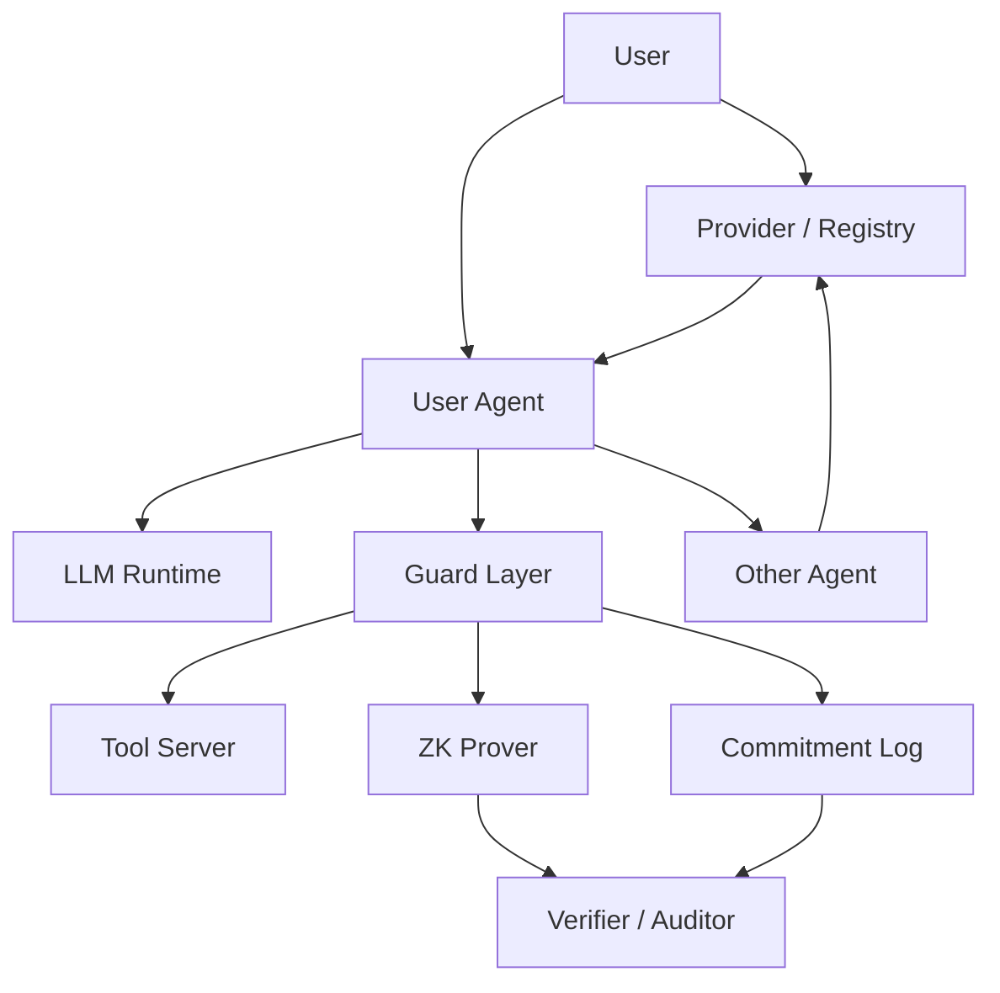
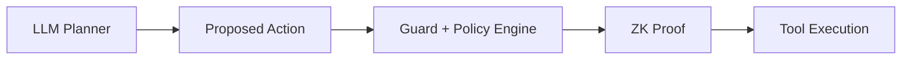

# IDEAL: zk-SNARK Agent 安全治理架构

## 0. 一句话结论

现实可行的方向不是“用 zk-SNARK 证明整个大模型推理绝对安全”，而是构建一个 **可验证 agent 治理层**：让 agent 在不泄露用户数据、系统提示词、私有工具输出和模型参数的情况下，证明自己满足身份授权、访问策略、工具调用约束、日志完整性、模型来源和安全分类器推理等可形式化条件。

我建议把这个系统命名为 **IDEAL**：

- **I - Identity**: agent 身份、注册、证书、Provider 签名。
- **D - Delegation**: 用户授权、agent 间委托、access control token。
- **E - Evidence**: prompt、tool call、human approval、sandbox trace 的承诺日志。
- **A - Attestation**: 对关键行为生成 zk proof 或可验证证明。
- **L - Limits**: 预算、速率、权限、数据流、风险等级的可证明限制。

## 1. 来自上述论文的核心判断

| 论文 | 对 IDEAL 的启发 | 直接可复用点 | 不应直接照搬的点 |
|---|---|---|---|
| [[SAGA - A Security Architecture for Governing AI Agentic Systems]] | agent 治理首先是身份、注册和访问控制问题 | Provider、OTK、access control token、ProVerif | 没有 ZK，Provider 仍可观察 metadata |
| [[Cloak Honey Trap - Proactive Defenses Against LLM Agents]] | LLM agent 可被环境信息误导，需要行为层防御 | honeypot、honeytoken、trap、CTF 评估 | 它是经验防御，没有密码学 guarantee |
| [[DIZK - A Distributed Zero Knowledge Proof System]] | 大规模证明需要分布式 prover | 大规模 witness/prover 工程经验 | Groth/QAP trusted setup 对频繁变化策略不友好 |
| [[Mystique - Efficient Conversions for Zero-Knowledge Proofs with Applications to Machine Learning]] | 真实 ML 需要处理类型转换和混合电路 | sVOLE、fixed/floating conversion、TensorFlow 集成 | interactive two-party ZK 不适合所有 public audit 场景 |
| [[zkCNN - Zero Knowledge Proofs for Convolutional Neural Network Predictions and Accuracy]] | 小型安全模型或 CNN 检测器可以证明推理正确 | GKR/sumcheck 证明 inference | 不适合直接证明大语言模型 token generation |
| [[Zero-Knowledge Proofs of Training for Deep Neural Networks - Kaizen]] | 模型训练来源可以异步证明 | zkPoT、IVC、dataset commitment | 训练大模型成本仍极高，只适合高价值离线审计 |
| [[FAIR ZK - A Scalable System to Prove Machine Learning Fairness in Zero-Knowledge]] | 不必证明逐样本 inference，可证明模型级统计性质 | fairness bound、聚合统计、Brakedown/GKR | bound 可能较松，proof size 大 |

## 2. 核心问题定义

### 2.1 背景

未来的 AI agent 不只是聊天接口，而会调用工具、读写文件、发邮件、访问数据库、部署代码、代表用户与其他 agent 协商。安全问题不再只是“模型回答是否有害”，而是：

- 谁在请求操作？
- 它是否被用户授权？
- 它是否使用了正确模型或安全过滤器？
- 它是否按 policy 调用了工具？
- 它是否泄露了隐私数据？
- 出事后能否审计，但又不暴露用户机密？

### 2.2 IDEAL 的目标

IDEAL 的目标是让 agent 能证明如下 statement：

$$\exists w:\operatorname{PolicyCheck}(x,w)=1$$

其中：

- $x$ 是公开可审计信息，例如 policy commitment、agent id、tool schema、risk level、time window、proof id。
- $w$ 是隐私 witness，例如用户 prompt、tool arguments、私有上下文、token secret、模型权重、安全分类器输出、approval trace。
- verifier 只知道“这次 agent 行为满足 policy”，但不看到敏感内容。

### 2.3 非目标

以下目标现阶段不现实，不建议作为 MVP：

- 证明 GPT 级 LLM 的完整 token-by-token 推理正确性。
- 证明自然语言语义上“绝对安全”“绝对无越权”。
- 对每一次普通聊天都生成昂贵 zk proof。
- 把所有 agent 消息都上链。
- 用一个通用 zkVM 直接证明完整浏览器、shell、LLM runtime 和所有工具执行。

更现实的策略是：只对 **高风险工具调用、跨 agent 委托、敏感数据访问、模型发布和安全审计** 生成 proof。

## 3. 威胁模型

### 3.1 参与方

- **User**: 拥有 agent，可定义 policy，可批准高风险操作。
- **Agent**: 代表用户执行任务，可能调用 LLM、工具、其他 agent。
- **Provider**: 注册 agent、维护 metadata、分发 OTK、检查 contact policy。
- **Tool Server**: 文件系统、邮件、数据库、shell、浏览器、云 API。
- **Auditor**: 内部安全团队、监管方、客户或智能合约 verifier。
- **Adversarial Agent**: 恶意或被攻陷的 agent。

### 3.2 攻击能力

攻击者可能：

- 注册恶意 agent。
- 诱导用户修改 contact policy。
- 盗用有效 token。
- prompt-inject benign agent。
- 伪造工具调用上下文。
- 删除或篡改日志。
- 使用假模型或跳过 safety classifier。
- 在审计时选择性披露成功案例。

### 3.3 基本假设

IDEAL 不试图解决所有底层问题。它假设：

- TLS、signature、hash、KDF 等标准密码学原语安全。
- agent sandbox 能记录 tool call event。
- 高风险工具有结构化 schema。
- policy 可以转成可判定规则。
- 对 ZK 的使用只覆盖可形式化、可计算的断言。

## 4. 系统架构



### 4.1 Provider 层

参考 SAGA，Provider 负责：

- user registration；
- agent registration；
- agent metadata 和 certificate；
- contact policy；
- OTK 分发；
- agent deactivation；
- blocklist 和 token refresh。

但 IDEAL 在 SAGA 基础上增加：

- 对 policy 的 commitment；
- 对 token issuance 的 commitment；
- 对 critical registry action 的 append-only log；
- 对某些 token 条件生成 zk proof，而不是直接暴露完整 policy。

### 4.2 Guard 层

Guard 是 agent 与 tool server 之间的强制中介。所有高风险工具调用必须通过 Guard：

- shell execution；
- file read/write；
- email/send message；
- browser action；
- database query；
- cloud deployment；
- payment/transaction；
- cross-agent delegation。

Guard 对每次调用生成事件：

$$e_i=(\operatorname{agentID},\operatorname{toolID},\operatorname{schemaHash},\operatorname{argCommit},\operatorname{policyCommit},t_i,r_i)$$

然后更新日志：

$$H_i=H(H_{i-1}\parallel e_i)$$

这个 $H_i$ 是审计锚点。真正的 tool arguments 可以保密，只暴露 commitment 和 proof。

### 4.3 ZK Prover 层

ZK Prover 不证明“agent 是善良的”，而证明具体可判定 statement。

建议分成 5 类 proof：

1. **Token validity proof**
2. **Tool policy compliance proof**
3. **Sensitive data flow proof**
4. **Safety classifier inference proof**
5. **Model provenance or fairness proof**

## 5. 可证明断言设计

### 5.1 Token Validity Proof

目标：agent 证明自己有合法 token，但不暴露 token 内容、用户 policy 和完整 agent graph。

公开输入：

$$x=(\operatorname{tokenCommit},\operatorname{agentID},\operatorname{receiverID},t,\operatorname{policyRoot})$$

私有 witness：

$$w=(\operatorname{token},K_{\mathrm{shared}},N,T_{\mathrm{issued}},T_{\mathrm{expire}},Q_{\max},P_{AC})$$

relation：

$$R_{\mathrm{token}}=\left\{
\begin{array}{l}
\operatorname{Dec}_{K_{\mathrm{shared}}}(\operatorname{token})=\langle N,T_{\mathrm{issued}},T_{\mathrm{expire}},Q_{\max},P_{AC}\rangle\\
T_{\mathrm{issued}}\le t\le T_{\mathrm{expire}}\\
\operatorname{usageCount}<Q_{\max}\\
\operatorname{PolicyMember}(P_{AC},\operatorname{policyRoot})=1
\end{array}
\right.$$

现实可行性：高。这个 relation 主要是 hash、comparison、Merkle membership、signature/token binding。适合 Groth16/Plonkish/Halo2/zkVM 小电路。

### 5.2 Tool Policy Compliance Proof

目标：agent 证明某个工具调用满足 policy，但不公开参数。

例子：数据库查询只访问允许列，邮件发送不包含 secret pattern，shell 命令不包含危险 flag，支付金额低于上限。

公开输入：

$$x=(\operatorname{toolID},\operatorname{schemaHash},\operatorname{argCommit},\operatorname{policyCommit})$$

私有 witness：

$$w=(\operatorname{args},\operatorname{policy},r)$$

relation：

$$R_{\mathrm{tool}}=\{\operatorname{Commit}(\operatorname{args},r)=\operatorname{argCommit}\land\operatorname{EvalPolicy}(\operatorname{policy},\operatorname{args})=1\}$$

推荐先做结构化 policy：

- amount $\le$ limit；
- domain $\in$ allowlist；
- SQL columns $\subseteq$ allowed columns；
- file path prefix $\in$ allowed roots；
- API method $\in$ allowed methods；
- recipient $\in$ approved contacts；
- command template match。

不建议 MVP 做自然语言 policy，因为语义不稳定，难以形成可靠 circuit。

### 5.3 Sensitive Data Flow Proof

目标：证明 agent 没有把敏感信息流向未经授权的工具。

方法：

1. 对输入上下文做 private tagging：

$$d_j=(\operatorname{chunkCommit}_j,\operatorname{label}_j)$$

2. Guard 维护数据流边：

$$d_j\rightarrow \operatorname{toolCall}_i$$

3. ZK 证明所有流向外部工具的数据满足 label policy：

$$\forall(d_j,\operatorname{toolCall}_i):\operatorname{Allowed}(\operatorname{label}_j,\operatorname{toolID}_i)=1$$

现实可行性：中等。难点不在 ZK，而在 label 的可靠来源。MVP 可以只做：

- 用户显式标记；
- regex/格式化 secret detector；
- DLP classifier 的 proof；
- 文件/目录级标签。

### 5.4 Safety Classifier Inference Proof

目标：不证明 LLM 本体，而证明一个小型安全分类器或策略模型确实被执行。

可证明模型：

- logistic regression；
- small MLP；
- CNN/malware classifier；
- tree/linear model；
- distilled safety classifier；
- prompt-injection detector。

relation：

$$R_{\mathrm{safety}}=\{\operatorname{Commit}(\theta)=c_\theta\land f_\theta(m)=y\land y\in\operatorname{SafeLabels}\}$$

这里 $m$ 可以是 prompt、tool args、URL、代码片段或输出摘要的 commitment。

对应论文迁移：

- 用 [[zkCNN - Zero Knowledge Proofs for Convolutional Neural Network Predictions and Accuracy]] 的 GKR/sumcheck 证明 CNN 或小模型推理。
- 用 [[Mystique - Efficient Conversions for Zero-Knowledge Proofs with Applications to Machine Learning]] 处理真实 ML 中的 fixed/floating conversion。
- 对小型 MLP 可借鉴 [[FAIR ZK - A Scalable System to Prove Machine Learning Fairness in Zero-Knowledge]] 的 GKR/lookup 后端。

现实可行性：中等偏高。不要证明 70B LLM，只证明小型 deterministic classifier。

### 5.5 Model Provenance Proof

目标：模型发布方证明“这个安全分类器/agent policy model 是按承诺的数据和训练流程得到的”。

relation：

$$R_{\mathrm{train}}=\{\operatorname{Commit}(D)=c_D\land\operatorname{Commit}(\theta_T)=c_T\land\theta_T=\operatorname{Train}(D,\theta_0,\operatorname{config})\}$$

对应论文：

- [[Zero-Knowledge Proofs of Training for Deep Neural Networks - Kaizen]]

现实可行性：低到中等。适合高价值、低频、离线审计，不适合每次模型更新都实时证明。

### 5.6 Fairness and Policy Model Audit Proof

目标：证明 agent 使用的 classifier 或 routing model 满足某些统计 fairness/compliance bound。

对应论文：

- [[FAIR ZK - A Scalable System to Prove Machine Learning Fairness in Zero-Knowledge]]

现实可行场景：

- 定期发布模型卡；
- 隐藏模型参数但证明 fairness bound；
- 监管审计；
- B2B 安全认证。

不适合作为每次 agent tool call 的在线证明。

## 6. MVP 设计

### 6.1 MVP 目标

做一个 **ZK-Verified Agent Tool Gateway**：

agent 调用高风险工具前，必须给出一个 proof：

$$\pi=\operatorname{Prove}(R_{\mathrm{token}}\land R_{\mathrm{tool}}\land R_{\mathrm{log}})$$

证明三件事：

1. agent 有有效 token；
2. tool arguments 满足 policy；
3. 本次调用被写入 append-only commitment log。

### 6.2 MVP 场景

建议从 3 个工具开始：

1. **Email tool**
   - policy: recipient 在 allowlist，attachment size $\le$ limit，不包含 secret regex。
2. **Shell tool**
   - policy: command 来自 template allowlist，工作目录在 sandbox 内，不包含网络外连。
3. **Database tool**
   - policy: SQL 只读，table/columns 在 allowlist，row limit $\le$ threshold。

### 6.3 MVP 技术选型

优先选择：

- Plonkish/Halo2 或 Circom/snarkjs 做小电路 proof；
- Merkle tree 做 policy membership；
- Poseidon/Rescue 类 hash 做 circuit-friendly commitment；
- EdDSA 或 Schnorr 做 circuit-friendly signature；
- 普通 TLS 和 Provider token 做外层通信；
- ProVerif/Tamarin 验证非 ZK 握手协议；
- JSON schema 限制 tool args。

暂不选择：

- 证明完整 LLM inference；
- 证明浏览器完整执行；
- 证明 arbitrary Python；
- 把 proof verification 全放链上；
- 使用 DIZK 级别分布式 prover 做 MVP。

### 6.4 MVP 数据结构

Agent metadata：

```json
{
  "agent_id": "agent:alice:calendar",
  "owner_id": "user:alice",
  "provider_sig": "sig",
  "policy_root": "0x...",
  "public_keys": {
    "tls": "...",
    "zk": "...",
    "delegation": "..."
  }
}
```

Tool call commitment：

```json
{
  "event_id": "uuid",
  "agent_id": "agent:alice:calendar",
  "tool_id": "email.send",
  "schema_hash": "0x...",
  "arg_commit": "0x...",
  "policy_root": "0x...",
  "prev_log_root": "0x...",
  "new_log_root": "0x...",
  "proof": "..."
}
```

### 6.5 MVP 证明 relation

$$R_{\mathrm{MVP}}=R_{\mathrm{token}}\land R_{\mathrm{policy}}\land R_{\mathrm{log}}$$

其中：

$$R_{\mathrm{policy}}=\operatorname{SchemaValid}(\operatorname{args})\land\operatorname{AllowlistValid}(\operatorname{args})\land\operatorname{LimitValid}(\operatorname{args})$$

$$R_{\mathrm{log}}=H(H_{i-1}\parallel\operatorname{Commit}(\operatorname{args},r)\parallel\operatorname{toolID}\parallel t)=H_i$$

这个 relation 足够小，可以作为第一个可落地项目。

## 7. 分阶段路线图

### Phase 1: Non-ZK Agent Governance Baseline

目标：先复制 SAGA 的基础治理层。

- agent registration；
- Provider-signed metadata；
- access contact policy；
- OTK/token；
- TLS；
- append-only logs；
- ProVerif model。

交付物：

- 一个 Provider service；
- 一个 Guard sidecar；
- 一个 tool gateway；
- 一个 audit log viewer。

### Phase 2: ZK Tool Policy Proof

目标：让高风险 tool call 附带 zk proof。

先实现：

- amount limit；
- allowlist membership；
- Merkle policy membership；
- log hash transition；
- token validity。

交付物：

- `email.send` proof；
- `db.query` proof；
- `shell.exec-template` proof；
- verifier CLI。

### Phase 3: ZK Safety Classifier

目标：证明 agent 调用工具前确实跑过 safety classifier。

先选小模型：

- prompt-injection detector；
- secret detector；
- SQL risk classifier；
- command risk classifier。

证明：

$$f_\theta(\operatorname{features}(\operatorname{args}))\in\operatorname{SafeLabels}$$

交付物：

- committed classifier；
- inference proof；
- safety proof verifier；
- 与 Guard 集成。

### Phase 4: Private Audit and Regulator Mode

目标：审计方可验证关键行为，但看不到用户隐私。

功能：

- selective disclosure；
- zero-knowledge membership proof；
- private log audit；
- proof bundle export；
- compliance dashboard。

### Phase 5: Model Provenance and Fairness

目标：低频证明模型来源和统计性质。

可接入：

- Kaizen-style training proof；
- FAIR ZK-style fairness proof；
- signed model cards；
- dataset commitment。

此阶段偏研究，不应阻塞前 4 阶段。

## 8. 与大模型安全的结合方式

### 8.1 LLM 本体不直接进 SNARK

大模型安全的现实方案是把 LLM 放在 untrusted planner 位置：



LLM 可以提出行动，但不能直接执行行动。执行权在 Guard，证明权在 Prover。

### 8.2 用 ZK 保护敏感信息

审计方常常想知道“agent 有没有违规”，但不该看到用户 prompt 和工具参数。ZK 的价值在这里最强：

- 证明 recipient 在 allowlist，但不公开 recipient。
- 证明 SQL 没有访问敏感列，但不公开完整 SQL。
- 证明金额低于限额，但不公开金额。
- 证明调用经过 safety classifier，但不公开 prompt。
- 证明日志没有被删改，但不公开日志内容。

### 8.3 用 deception 做外层防御

从 Cloak/Honey/Trap 借鉴：

- 在 tool gateway 中布置 honeytoken。
- 给外部 agent 可见环境放置 trap endpoints。
- 对未经授权 agent 返回 decoy metadata。
- 检测 agent 是否访问不该访问的 fake asset。

注意：deception 不提供 formal guarantee，但它能补上 ZK 无法处理的语义攻击面。

## 9. 研究创新点

### 9.1 ZK-verified delegation token

在 SAGA token 基础上加入 ZK：

- 证明 token 有效；
- 证明 token 满足用户 policy；
- 不暴露 token 的具体 quota、过期时间或用户隐私策略。

### 9.2 Private policy audit for agent tool calls

让企业或监管方验证 agent 行为合规，而不接触用户数据。

### 9.3 ZK safety classifier as a guard primitive

不证明 LLM，只证明小型安全模型已正确执行。这是最现实的 ZKML 与 agent 安全结合点。

### 9.4 Commitment log + selective disclosure

把所有 tool calls 写成 commitment chain，需要时只披露争议事件的局部 witness 或 zero-knowledge proof。

### 9.5 Hybrid formal security

组合两类安全：

- ProVerif/Tamarin 验证握手协议；
- zkSNARK 验证行为约束；
- empirical red-team 验证 LLM agent 对抗行为。

这比单纯宣称“AI 安全”更扎实。

## 10. 最小论文题目建议

如果把它发展成论文，可以考虑：

1. **IDEAL: Zero-Knowledge Attested Governance for LLM Agent Tool Use**
2. **zkAgentGuard: Privacy-Preserving Proofs of Policy Compliance for Agentic AI Systems**
3. **Verifiable Delegation and Private Audit for LLM Agents**
4. **Zero-Knowledge Tool-Use Attestation for Secure Agentic Systems**

最推荐第 2 个，因为它清楚表达：

- 对象是 agent；
- 核心是 policy compliance；
- 方法是 ZK；
- 场景是 privacy-preserving audit。

## 11. 实验设计

### 11.1 Microbenchmarks

测量：

- token proof time；
- allowlist proof time；
- range proof time；
- log transition proof time；
- verifier time；
- proof size；
- memory。

### 11.2 Tool-level benchmarks

工具：

- email；
- shell；
- SQL；
- browser；
- calendar；
- cloud API。

指标：

- proof latency；
- tool latency overhead；
- false reject rate；
- policy expressiveness；
- audit storage overhead。

### 11.3 Agent security evaluation

参考 Cloak/Honey/Trap：

- 正常 agent 完成任务成功率；
- malicious agent 越权成功率；
- prompt injection 后 tool misuse 成功率；
- token theft 后 damage window；
- honeytoken detection rate；
- adaptive adversary bypass rate。

### 11.4 ZKML classifier evaluation

小模型任务：

- prompt injection detector；
- secret detector；
- shell risk classifier；
- SQL risk classifier。

测量：

- classifier accuracy；
- proof time；
- proof size；
- verifier time；
- 与不证明 classifier 的 Guard baseline 对比。

## 12. 现实难点

### 12.1 Policy formalization

自然语言 policy 很难直接证明。需要先编译成结构化 policy DSL。

建议 DSL 支持：

- `allow(domain in set)`
- `deny(path outside prefix)`
- `limit(amount <= x)`
- `require(human_approval)`
- `require(classifier_label in safe)`
- `budget(count <= q)`
- `time(before expiry)`

### 12.2 Witness extraction

ZK proof 需要 witness，而 agent runtime 往往是非确定、异步、多工具交互。必须让 Guard 在工具边界截获 witness。

### 12.3 Circuit cost

JSON parsing、regex、signature verification、TLS transcript 都可能很贵。MVP 应避免在 circuit 中做完整解析，改用：

- schema-normalized args；
- pre-hashed fields；
- circuit-friendly signature；
- Merkle membership；
- fixed templates。

### 12.4 Semantic safety

“这个回答是否有害”不是稳定的数学 predicate。现实做法是证明：

- 调用了某个 committed classifier；
- classifier 输出在 safe set；
- classifier 本身有定期 fairness/provenance proof；
- 高风险情形仍需要 human approval。

### 12.5 证明延迟

在线工具调用不能等几十秒。策略：

- 小电路在线 proof；
- 大 proof 异步生成；
- 临时允许但标记为 pending audit；
- 高风险操作必须等待 proof；
- proof batching。

## 13. 推荐的第一版原型

### 原型名称

**zkAgentGuard**

### 功能

1. 注册 agent 和 policy。
2. agent 请求调用工具。
3. Guard 生成 commitment。
4. Prover 证明 tool call 满足 policy。
5. Tool server 只接受 proof valid 的调用。
6. Audit dashboard 显示 proof、commitment log 和 selective disclosure。

### 第一版只做 3 条 policy

Email:

$$\operatorname{recipient}\in\operatorname{Allowlist}\land\operatorname{attachmentSize}\le L$$

SQL:

$$\operatorname{table}\in\operatorname{AllowedTables}\land\operatorname{columns}\subseteq\operatorname{AllowedColumns}\land\operatorname{limit}\le N$$

Shell:

$$\operatorname{commandTemplate}\in\operatorname{Allowlist}\land\operatorname{cwd}\in\operatorname{AllowedPrefix}$$

### 第一版不做

- 任意自然语言 policy；
- 完整 LLM proof；
- 大模型训练 proof；
- 浏览器 DOM 全状态 proof；
- 链上验证所有 tool calls。

## 14. 结论

IDEAL 的最佳落地点是 **agent tool-use attestation**。ZK 负责证明“可形式化的安全约束确实满足”，SAGA 负责身份和授权，Cloak/Honey/Trap 负责经验对抗防御，ZKML 负责小型安全模型和低频模型审计。

最现实的研究命题是：

> 在不泄露用户 prompt、工具参数和私有上下文的前提下，让 LLM agent 对高风险工具调用生成可验证的 policy compliance proof。

这比证明完整 LLM 推理更可行，也更贴近 agent 安全真正的痛点。
