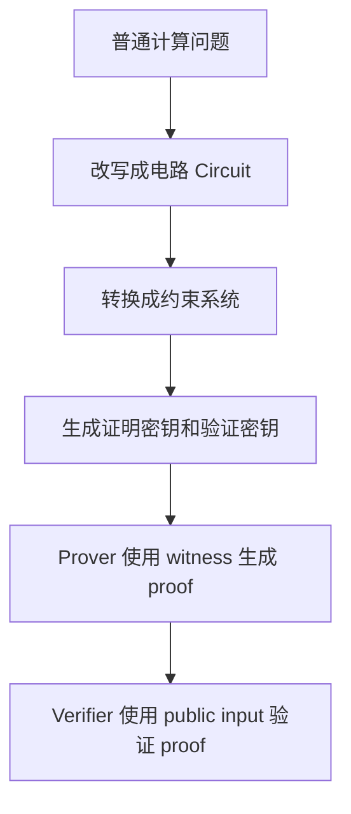
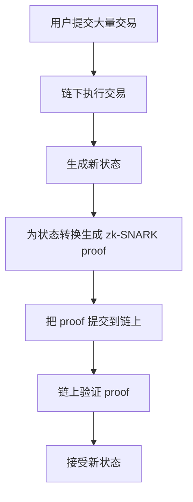

# zk-SNARK 入门教学

> 说明：你写的 “zk-SNACK” 通常应为 **zk-SNARK**。  
> 全称：**Zero-Knowledge Succinct Non-Interactive Argument of Knowledge**。  
> 建议先读本目录下的 [教学.md](/Users/xsl/Desktop/Obsidian/Obsidian/零知识证明问题/教学.md)，再读本文。

---

## 1. zk-SNARK 是什么

zk-SNARK 是零知识证明的一类具体技术。它可以让证明者生成一段很短的证明，向验证者证明：

> 我知道某些秘密输入，并且我按照指定计算规则得到了正确结果。

同时满足：

- 不泄露秘密输入。
- 证明体积很小。
- 验证速度很快。
- 通常可以非交互式验证。

把它拆开看：

| 部分 | 含义 |
| --- | --- |
| zk | Zero-Knowledge，零知识，不泄露秘密 |
| S | Succinct，简洁，证明短、验证快 |
| N | Non-Interactive，非交互式，一次生成，公开验证 |
| ARK | Argument of Knowledge，证明者确实知道某个 witness |

初学者可以先把 zk-SNARK 理解为：

> 一个能把“我正确完成了一段计算”压缩成短证明的系统。

---

## 2. zk-SNARK 想解决什么问题

普通证明经常有两个麻烦：

1. 验证者可能需要重新执行整段计算。
2. 验证过程可能会看到隐私数据。

zk-SNARK 的目标是让验证者不用重新计算全部过程，也不用看到秘密数据，只验证一个 proof。

例子：

```text
我知道两个秘密数 a 和 b，
并且 a * b = 21。
```

如果直接告诉别人：

```text
a = 3
b = 7
```

就泄露了秘密。

如果用 zk-SNARK，证明者可以提交一个 proof，验证者只知道：

```text
确实存在某些 a 和 b，使得 a * b = 21。
```

但验证者不知道 `a` 和 `b` 具体是多少。

---

## 3. zk-SNARK 的基本角色

| 角色或对象 | 含义 |
| --- | --- |
| Prover | 证明者，生成 proof |
| Verifier | 验证者，检查 proof |
| Statement | 公开陈述，要证明的命题 |
| Witness | 秘密见证，让命题成立的私有数据 |
| Circuit | 电路，把计算过程改写成约束 |
| Proof | 证明，证明者输出的短数据 |
| Public Input | 公开输入，验证者能看到 |
| Private Input | 私有输入，只有证明者知道 |

在工程里，你通常会写一个电路：

```text
输入：public y，private x
约束：y = x * x + 3
```

然后证明者用秘密 `x` 生成 proof，验证者用公开的 `y` 验证 proof。

---

## 4. 一条主线：从程序到证明

zk-SNARK 的工作流程可以概括为：



更短地说：

```text
程序 -> 电路 -> 约束 -> proof -> verify
```

这条线非常重要。很多 zk-SNARK 教程一开始会让人迷路，就是因为术语很多，但主线其实就是这一条。

---

## 5. 电路 Circuit 是什么

在 zk-SNARK 里，不能直接证明任意自然语言陈述。你要先把陈述变成数学约束。

例如你想证明：

```text
我知道 x，使得 y = x * x + 3。
```

可以拆成两个步骤：

```text
t = x * x
y = t + 3
```

然后变成约束：

```text
t 必须等于 x * x
y 必须等于 t + 3
```

只要这些约束都满足，说明计算过程是正确的。

所以，电路不是电子电路，而是：

> 用加法、乘法和约束描述计算过程的一种形式。

---

## 6. R1CS：最常见的入门约束形式

很多 zk-SNARK 教程会提到 **R1CS**。

R1CS 全称是：

```text
Rank-1 Constraint System
```

它把计算写成一组形如下面的约束：

```text
A * B = C
```

这里的 `A`、`B`、`C` 不是普通单个数字，而是由变量线性组合出来的表达式。

初学时可以先记住：

> R1CS 是一种把程序转换成乘法约束的方法。

比如：

```text
y = x * x + 3
```

可以拆成：

```text
t = x * x
y = t + 3
```

对应约束：

```text
x * x = t
(t + 3) * 1 = y
```

只要证明者提供的 `x`、`t`、`y` 满足所有约束，就说明计算是对的。

---

## 7. Trusted Setup：可信设置

很多经典 zk-SNARK 系统需要一个初始化阶段，叫 **Trusted Setup**。

它会生成两类密钥：

| 密钥 | 用途 |
| --- | --- |
| Proving Key | 证明者用它生成 proof |
| Verification Key | 验证者用它验证 proof |

问题在于，生成这些密钥时可能会产生一段临时秘密，俗称：

```text
toxic waste
```

如果这个临时秘密没有被销毁，攻击者可能伪造证明。

所以可信设置的核心问题是：

> 我们如何相信 setup 阶段没有人保留那段危险秘密？

常见解决思路：

- 多方参与仪式，只要至少一个参与者诚实销毁秘密，系统就安全。
- 使用不需要 trusted setup 的证明系统，比如一些 STARK 或 transparent proof 系统。

注意：不是所有 SNARK 都需要同样形式的 trusted setup，新协议在不断改进这一点。

---

## 8. zk-SNARK 的典型流程

一个常见 zk-SNARK 工程流程如下：

### 8.1 编写电路

比如用 Circom 写：

```text
template SquarePlusThree() {
    signal input x;
    signal input y;
    signal t;

    t <== x * x;
    y === t + 3;
}
```

这里：

- `x` 是私有输入。
- `y` 是公开输入。
- 约束是 `y = x * x + 3`。

### 8.2 编译电路

把电路编译成约束系统。

输出通常包括：

- 约束文件。
- witness 计算程序。
- 中间表示文件。

### 8.3 生成 witness

证明者输入秘密数据，计算 witness。

例如：

```text
x = 4
y = 19
```

因为：

```text
4 * 4 + 3 = 19
```

### 8.4 生成 proof

证明者用：

- proving key
- witness
- public input

生成 proof。

### 8.5 验证 proof

验证者用：

- verification key
- proof
- public input

检查证明是否有效。

验证者不需要知道 `x = 4`。

---

## 9. 为什么 zk-SNARK 证明可以很短

zk-SNARK 的 “Succinct” 指的是：

- proof 通常很小。
- 验证时间通常远小于重新执行全部计算。

这对区块链很关键。

假设链下有 10,000 笔交易。如果链上重新执行所有交易，会很贵。

使用 zk-SNARK 时，可以让链下证明者提交：

```text
新状态 root + 一个 zk proof
```

链上合约只验证 proof。如果 proof 有效，就相信这批交易的状态更新合法。

---

## 10. zk-SNARK 与区块链扩容

zk-Rollup 的核心思路：



链上不需要逐笔执行所有交易，只需要验证：

> 这批交易从旧状态到新状态的转换是合法的。

这就是很多 zk-Rollup 能扩容的原因。

---

## 11. zk-SNARK 与隐私

zk-SNARK 也可以用于隐私保护。

比如隐私支付系统可以证明：

```text
我拥有一张未花费的票据。
我知道它的秘密。
我没有重复花费。
交易格式合法。
```

但不公开：

- 付款人是谁。
- 收款人是谁。
- 金额是多少。
- 票据对应的秘密是什么。

这里要注意：

> zk-SNARK 本身提供的是证明层隐私，不代表整个系统天然匿名。

真实隐私还会受到地址复用、网络层、交易时间、金额模式、钱包交互等因素影响。

---

## 12. 常见 zk-SNARK 方案

| 名称 | 简要特点 |
| --- | --- |
| Groth16 | 证明极短，验证快，但通常每个电路需要 trusted setup |
| PLONK | 更通用的 universal setup 思路，工程上很流行 |
| Marlin | 通用 SNARK 方向之一 |
| Sonic | 早期 universal setup SNARK 代表之一 |
| Halo / Halo2 | 递归证明方向重要，减少或避免传统 trusted setup |

初学顺序建议：

1. 先理解 Groth16，因为资料多、概念典型。
2. 再理解 PLONK，因为现代工程中很重要。
3. 最后再看递归证明、lookup、folding 等进阶主题。

---

## 13. zk-SNARK 和 zk-STARK 的区别

| 对比项 | zk-SNARK | zk-STARK |
| --- | --- | --- |
| 证明大小 | 通常更小 | 通常更大 |
| 验证速度 | 通常很快 | 也可以很快，但 proof 更大 |
| Trusted Setup | 很多方案需要 | 通常不需要 |
| 数学基础 | 常见为椭圆曲线、配对、多项式承诺 | 常见为哈希、FRI、多项式 IOP |
| 抗量子性 | 取决于具体方案，经典 SNARK 通常不强调 | 通常更强调抗量子 |
| 工程使用 | 链上验证成本低，很常见 | 大规模证明、透明性场景常见 |

不要简单理解成谁一定更好。选择取决于：

- 证明大小要求。
- 链上验证成本。
- 是否能接受 trusted setup。
- 证明生成成本。
- 生态工具成熟度。

---

## 14. 初学者容易混淆的点

### 14.1 zk-SNARK 不是一个具体算法

它是一类证明系统。Groth16、PLONK、Marlin 等都可以属于 SNARK 方向。

### 14.2 零知识不是默认必须开启

有些证明系统可以只证明计算正确，不隐藏 witness。是否零知识通常取决于协议和实现。

### 14.3 电路越复杂，证明越贵

你写的普通程序越复杂，转换成约束后约束数量可能越多。约束越多，生成证明通常越慢。

### 14.4 Public input 会被看到

只有 private witness 是隐藏的。公开输入会被验证者看到。

### 14.5 proof 有效不代表业务一定安全

proof 只能证明电路表达的规则成立。如果电路规则写错了，proof 仍然可能有效。

所以 ZK 工程里非常重要的一件事是：

> 电路审计。

---

## 15. 一个完整例子：证明知道平方根

我们设计一个简单命题：

```text
我知道一个秘密 x，使得 x * x = y。
```

公开输入：

```text
y = 49
```

私有输入：

```text
x = 7
```

电路约束：

```text
x * x === y
```

证明者生成 proof 后，验证者知道：

```text
证明者确实知道某个 x，使得 x 的平方是 49。
```

但在理想情况下，验证者不知道这个 `x` 是 7 还是其他满足条件的值。

注意这个例子仍然太小，因为平方根可以被猜出来。真实应用会让 witness 空间足够大，避免暴力枚举。

---

## 16. 从 Circom 角度看 zk-SNARK

Circom 是常见的 ZK 电路语言。它的核心不是写普通业务程序，而是写约束。

一个极简电路：

```text
pragma circom 2.0.0;

template Multiplier() {
    signal input a;
    signal input b;
    signal output c;

    c <== a * b;
}

component main = Multiplier();
```

如果 `a` 和 `b` 是私有输入，`c` 是公开输出，那么可以证明：

```text
我知道 a 和 b，使得 a * b = c。
```

但验证者只看到 `c` 和 proof。

### `<==` 和 `===` 的直觉

在 Circom 中：

- `<==` 通常表示赋值并添加约束。
- `===` 表示显式约束两边相等。

初学时要特别小心：

> ZK 电路里，计算了某个值不等于约束了某个值。

如果只计算不约束，证明者可能绕过你以为存在的检查。

---

## 17. 学习路线

### 第一阶段：概念

目标：理解 zk-SNARK 证明的是什么。

重点：

- statement
- witness
- public input
- private input
- circuit
- constraint
- proof

### 第二阶段：小电路

目标：能写出简单约束。

练习：

- 乘法器。
- 平方检查。
- 哈希原像证明。
- Merkle path 成员证明。

### 第三阶段：工具链

目标：能跑通一个最小例子。

可以学习：

- Circom
- SnarkJS
- Groth16
- PLONK

典型流程：

```text
写 circuit -> 编译 -> 生成 witness -> setup -> prove -> verify
```

### 第四阶段：应用

目标：理解真实系统怎么用 proof。

方向：

- zk login
- 隐私支付
- zk voting
- zk identity
- zk rollup
- proof aggregation
- recursive proof

---

## 18. 练习题

### 练习 1：区分公开与私有

命题：

```text
我知道 x，使得 y = x * x + 3。
```

如果 `y` 是验证者要检查的结果：

- 哪个是 public input？
- 哪个是 private witness？
- 电路约束应该是什么？

### 练习 2：设计年龄证明

你想证明：

```text
我的年龄 >= 18。
```

但不想公开生日。

思考：

- 公开输入可以是什么？
- 私有输入可以是什么？
- 需要防止哪些作弊？

### 练习 3：Merkle 成员证明

你想证明：

```text
我的账号在某个白名单 Merkle Tree 里。
```

但不想公开自己是哪个账号。

思考：

- Merkle root 是 public input 还是 private input？
- Merkle path 是 public input 还是 private witness？
- 为什么这个例子适合 ZK？

---

## 19. 关键词表

| 关键词 | 中文理解 |
| --- | --- |
| Arithmetization | 算术化，把计算变成数学约束 |
| Constraint | 约束，必须满足的等式关系 |
| Circuit | 电路，约束组成的计算描述 |
| Witness | 见证，证明者知道的秘密数据 |
| Public Input | 公开输入，验证者可见 |
| Proving Key | 证明密钥，用来生成 proof |
| Verification Key | 验证密钥，用来验证 proof |
| Trusted Setup | 可信设置，生成证明和验证所需参数 |
| Pairing | 双线性配对，很多经典 SNARK 使用的数学工具 |
| Polynomial Commitment | 多项式承诺，现代证明系统的重要组件 |
| Recursive Proof | 递归证明，用一个 proof 验证另一个 proof |

---

## 20. 总结

zk-SNARK 的核心可以压缩成一句话：

> 把一个计算过程变成约束，再把“我知道满足这些约束的 witness”变成一个短小、可快速验证、可隐藏秘密的 proof。

你学习 zk-SNARK 时，可以始终抓住这四个问题：

1. 我要证明的 statement 是什么？
2. 哪些数据是 public input？
3. 哪些数据是 private witness？
4. 电路是否真的约束了我想证明的规则？

只要这四个问题想清楚，zk-SNARK 的大量术语都会慢慢归位。

