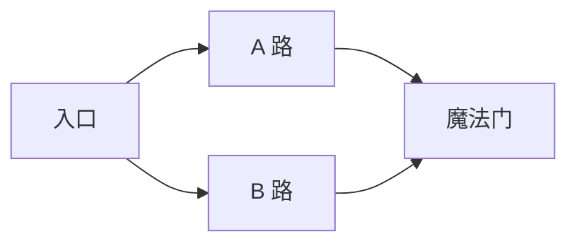
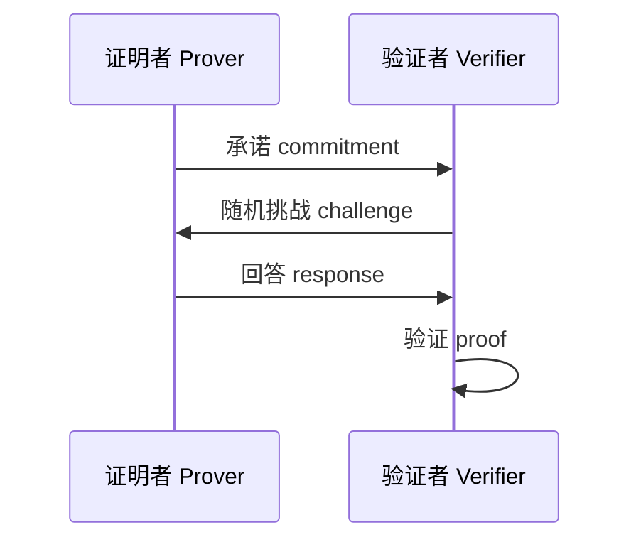
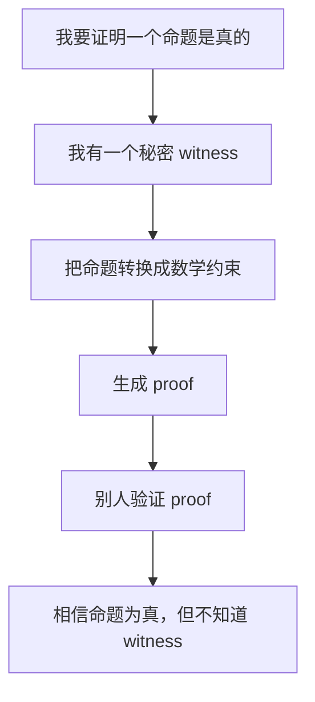

# 零知识证明入门教学

> 适合对象：刚开始接触密码学、区块链或隐私计算的学习者。  
> 参考入口：你提供的 B 站视频链接 <https://www.bilibili.com/video/BV1iacBebE1E/>。  
> 阅读目标：理解零知识证明到底在证明什么、为什么可信、它和区块链里的 zk-SNARK/zk-STARK 有什么关系。

---

## 1. 一句话理解零知识证明

**零知识证明**，英文是 **Zero-Knowledge Proof, ZKP**，是一种密码学协议：

> 证明者可以向验证者证明“我知道某个秘密”或“某个陈述是真的”，但不泄露这个秘密本身，也不泄露除“陈述为真”以外的额外信息。

举一个生活化例子：

- 我想证明我知道某个保险柜密码。
- 但我不想把密码告诉你。
- 如果我能在你监督下打开保险柜，并且不暴露密码本身，那么你会相信我确实知道密码。

零知识证明做的事情，就是把这种“我能证明我知道，但我不告诉你我知道什么”的思想，变成严格的数学协议。

---

## 2. 三个核心性质

一个合格的零知识证明通常要满足三个性质：

### 2.1 完备性：真的能证明出来

如果陈述是真的，并且证明者确实知道秘密，那么诚实的验证者应该能够接受这个证明。

例子：

- 我真的知道密码。
- 我按照协议操作。
- 你应该相信我。

这叫 **Completeness**。

### 2.2 可靠性：假的很难蒙混过关

如果陈述是假的，或者证明者根本不知道秘密，那么他几乎不可能骗过验证者。

例子：

- 我不知道密码。
- 但我想装作知道。
- 协议应该让这种欺骗成功的概率极低。

这叫 **Soundness**。

### 2.3 零知识性：除了真假，不泄露别的信息

验证者只能知道“这个陈述是真的”，不能学到秘密本身。

例子：

- 你知道我会开保险柜。
- 但你不知道密码是多少。

这叫 **Zero-Knowledge**。

可以把三者记成：

| 性质 | 解决的问题 |
| --- | --- |
| 完备性 | 真的可以被证明 |
| 可靠性 | 假的很难伪装成真的 |
| 零知识性 | 证明过程中不泄露秘密 |

---

## 3. 经典直觉例子：洞穴与魔法门

零知识证明入门时经常会用“洞穴”故事来解释。

假设有一个环形洞穴，左右两条路分别叫 A 路和 B 路，中间有一扇魔法门。只有知道咒语的人才能打开这扇门，从 A 路穿到 B 路，或者从 B 路穿到 A 路。



证明者想向验证者证明：

> 我知道打开魔法门的咒语。

但证明者不想说出咒语。

协议可以这样进行：

1. 证明者先进入洞穴，随机选择 A 路或 B 路。
2. 验证者站在洞口，看不到证明者走了哪条路。
3. 验证者随机喊：“请从 A 路出来！”或者“请从 B 路出来！”
4. 如果证明者知道咒语，无论验证者要求哪条路，他都能通过魔法门调整路线并从正确出口出来。
5. 如果证明者不知道咒语，他只能在一开始碰巧选对那条路，单次成功概率大约是 1/2。
6. 重复很多轮后，如果每次都成功，验证者就可以非常确信证明者知道咒语。

这个例子对应三个性质：

- **完备性**：知道咒语的人总能按要求走出来。
- **可靠性**：不知道咒语的人只能靠猜，重复很多轮后几乎不可能一直猜对。
- **零知识性**：验证者没有听到咒语，只知道证明者大概率真的知道咒语。

---

## 4. 零知识证明中的角色和术语

学习 ZKP 时，经常会看到这些词：

| 术语 | 英文 | 含义 |
| --- | --- | --- |
| 证明者 | Prover | 想证明某件事的人 |
| 验证者 | Verifier | 检查证明是否可信的人 |
| 陈述 | Statement | 要证明的公开命题 |
| 见证 | Witness | 能让陈述成立的秘密信息 |
| 证明 | Proof | 证明者生成、验证者检查的一段数据 |

用保险柜例子对应：

- 陈述：我知道能打开这个保险柜的密码。
- 见证：真正的密码。
- 证明者：知道密码的人。
- 验证者：想确认对方知道密码的人。
- 证明：一次不泄露密码的验证过程。

在密码学里，通常写成：

> 我想证明：存在一个秘密 `w`，使得公开陈述 `x` 成立。

其中：

- `x` 是公开信息。
- `w` 是 witness，也就是秘密。

---

## 5. 交互式证明与非交互式证明

### 5.1 交互式证明

交互式证明需要证明者和验证者来回通信。

类似洞穴例子：

1. 证明者先做一个承诺。
2. 验证者随机提出挑战。
3. 证明者根据挑战回答。
4. 验证者检查回答是否正确。

这种结构很常见：



### 5.2 非交互式证明

非交互式证明不需要来回多轮通信。证明者直接生成一个证明，任何人拿到后都可以验证。

这对区块链非常重要，因为链上环境不适合一来一回地反复通信。

常见做法是使用 **Fiat-Shamir 变换**：

> 用哈希函数模拟验证者的随机挑战。

也就是把：

```text
验证者随机给挑战
```

改成：

```text
挑战 = Hash(公开输入, 承诺)
```

这样证明者可以自己算出挑战，并生成一个可以公开验证的证明。

---

## 6. 一个稍微数学化的例子：证明我知道离散对数

下面这个例子叫 **Schnorr 识别协议**，是理解很多现代零知识协议的好入口。

先不害怕公式。重点是理解流程。

### 6.1 问题背景

假设有一个公开的生成元 `G`，证明者有一个秘密数字 `x`，并公开了：

```text
P = xG
```

这里可以把 `G` 理解成一个特殊的数学对象，`xG` 理解成“把 G 重复操作 x 次”的结果。

公开信息：

- `G`
- `P`

秘密信息：

- `x`

证明者想证明：

> 我知道一个秘密 `x`，使得 `P = xG`。

但他不想泄露 `x`。

### 6.2 协议流程

1. 证明者随机选择一个临时秘密 `r`。
2. 证明者计算：

   ```text
   R = rG
   ```

   然后把 `R` 发给验证者。

3. 验证者随机给一个挑战 `c`。
4. 证明者计算：

   ```text
   s = r + cx
   ```

   然后把 `s` 发给验证者。

5. 验证者检查：

   ```text
   sG == R + cP
   ```

为什么这个检查成立？

因为：

```text
sG = (r + cx)G
   = rG + c(xG)
   = R + cP
```

验证者看到的是 `R`、`c`、`s`，但没有直接看到 `x`。

### 6.3 为什么它有零知识性

这个协议的直觉是：

- `r` 是随机数，会把秘密 `x` 藏起来。
- `s = r + cx` 看起来像被随机数掩盖过的结果。
- 验证者只能确认“证明者确实能回答随机挑战”，但不能从回答中直接还原出 `x`。

注意：真实密码学系统会在有限域、椭圆曲线群等严格数学结构里运行，不能直接用普通整数随便替代。

---

## 7. 从 ZKP 到 zk-SNARK、zk-STARK

你以后经常会看到这些词：

| 名称 | 大致含义 |
| --- | --- |
| ZKP | 零知识证明的总称 |
| zk-SNARK | 简洁、非交互式、通常证明很短、验证很快的一类零知识证明 |
| zk-STARK | 不依赖可信设置、抗量子安全性更好的方向之一，但证明通常更大 |
| zk-Rollup | 用零知识证明压缩并验证大量链下计算的区块链扩容方案 |

### 7.1 zk-SNARK 是什么

zk-SNARK 全称是：

```text
Zero-Knowledge Succinct Non-Interactive Argument of Knowledge
```

拆开看：

- **Zero-Knowledge**：零知识，不泄露秘密。
- **Succinct**：简洁，证明很短，验证很快。
- **Non-Interactive**：非交互式，一次生成，公开验证。
- **Argument of Knowledge**：证明者确实知道某个 witness。

### 7.2 zk-STARK 是什么

zk-STARK 全称是：

```text
Zero-Knowledge Scalable Transparent Argument of Knowledge
```

重点在：

- **Scalable**：适合大规模计算证明。
- **Transparent**：通常不需要可信设置。

### 7.3 为什么区块链喜欢 ZKP

区块链有两个常见痛点：

1. 所有人都要重复验证，成本高。
2. 数据公开透明，隐私弱。

ZKP 可以分别解决：

- **扩容**：链下做大量计算，链上只验证一个短证明。
- **隐私**：证明交易合法，但不公开交易细节。

---

## 8. 常见应用场景

### 8.1 隐私支付

用户可以证明：

> 我有足够余额，并且这笔交易没有双花。

但不公开：

- 我的余额是多少。
- 我给谁转账。
- 我转了多少钱。

### 8.2 身份与资格证明

你可以证明：

> 我已经成年。

但不公开：

- 生日。
- 身份证号。
- 家庭住址。

### 8.3 区块链扩容

Rollup 可以把很多笔交易放到链下执行，然后向链上提交：

- 状态更新结果。
- 一个证明这些更新合法的 ZK proof。

链上不需要重新执行所有交易，只需要验证证明。

### 8.4 合规与审计

企业可以证明：

> 我满足某些合规要求。

但不公开完整的商业数据或用户隐私数据。

---

## 9. 零知识证明不是什么

初学者很容易产生几个误解。

### 9.1 零知识证明不是加密

加密是：

> 把明文变成密文，授权的人可以解密。

零知识证明是：

> 不透露秘密，但证明某个命题是真的。

它们都和隐私有关，但解决的问题不同。

### 9.2 零知识不等于绝对匿名

ZKP 可以隐藏某些信息，但系统整体是否匿名，还取决于：

- 地址模型。
- 元数据。
- 网络层信息。
- 前端和钱包行为。
- 交易时间和金额模式。

### 9.3 证明短不代表生成便宜

很多 ZK 系统验证很快，但生成证明可能很慢、很耗内存。

所以要区分：

- Proving time：生成证明的成本。
- Verification time：验证证明的成本。
- Proof size：证明大小。

---

## 10. 学习路线

### 第一阶段：建立直觉

目标：知道 ZKP 在解决什么问题。

建议学习：

- 洞穴例子。
- 数独证明例子。
- “证明我知道密码但不告诉你密码”的思想。
- 完备性、可靠性、零知识性。

你可以问自己：

> 如果验证者什么秘密都没学到，他为什么还会相信证明者？

这就是 ZKP 最核心的思维转换。

### 第二阶段：理解交互式协议

目标：看懂 commitment、challenge、response 的结构。

建议学习：

- Schnorr 协议。
- Fiat-Shamir 变换。
- 哈希函数在非交互证明中的作用。

关键词：

- commitment
- challenge
- response
- witness
- statement

### 第三阶段：理解“把计算变成证明”

现代 ZK 不只是证明“我知道密码”，而是证明：

> 我正确执行了一段计算。

比如：

```text
我知道私有输入 a 和 b，
使得 a * b = 公开结果 c。
```

或者：

```text
我知道一组交易，
它们从旧状态合法地转移到了新状态。
```

为了做到这件事，系统通常会把计算转换成约束：

```text
约束都满足 <=> 计算过程正确
```

### 第四阶段：接触工程工具

当你有了基本概念后，可以再看工具：

- Circom：写电路的 DSL。
- SnarkJS：生成和验证 SNARK 证明。
- Halo2：更底层、更灵活的 ZK 开发框架。
- Noir：相对更接近普通编程语言体验的 ZK 语言。

初学时不建议一开始就陷入工具细节。先理解“证明什么”和“为什么可信”更重要。

---

## 11. 一个可手算的小练习

假设你想证明自己知道两个秘密数 `a` 和 `b`，满足：

```text
a * b = 21
```

但你不想告诉别人 `a` 和 `b` 分别是多少。

公开陈述：

```text
存在 a 和 b，使得 a * b = 21
```

秘密 witness：

```text
a = 3
b = 7
```

当然，这个例子太小，别人可以直接猜出来。但它能帮助你理解现代 ZK 的基本形态：

```text
公开输入 + 私有 witness + 约束系统 => proof
```

真实系统会把 witness 空间做得非常大，让别人无法靠暴力枚举猜出来。

---

## 12. ZK 电路的直觉

在很多 ZK 系统里，我们会把程序改写成“电路”或“约束”。

比如普通计算：

```text
y = x * x + 3
```

可以拆成：

```text
t = x * x
y = t + 3
```

然后变成约束：

```text
t 必须等于 x * x
y 必须等于 t + 3
```

证明者想证明：

> 我知道一个秘密 x，使得公开的 y 满足 y = x * x + 3。

验证者不需要知道 `x`，只要验证 proof。

---

## 13. 初学者最重要的思维模型

你可以把 ZKP 理解成四层：



更短地说：

```text
知道秘密的人，能生成证明。
不知道秘密的人，几乎无法伪造证明。
验证证明的人，不会学到秘密。
```

---

## 14. 推荐阅读顺序

如果你之后继续学，可以按这个顺序：

1. 先看零知识证明的故事类例子，比如洞穴、数独、色盲球。
2. 学会三个性质：完备性、可靠性、零知识性。
3. 看 Schnorr 协议，理解交互式证明。
4. 看 Fiat-Shamir 变换，理解非交互式证明。
5. 理解 R1CS 或 Plonkish arithmetization，也就是“把程序变成约束”。
6. 再看 zk-SNARK、zk-STARK、zk-Rollup 的工程实现。

---

## 15. 自测问题

读完后，可以尝试回答这些问题：

1. 为什么“我知道密码但不告诉你密码”可以成为一个可验证的证明？
2. 零知识证明的三个性质分别是什么？
3. 洞穴例子里，为什么重复多轮可以提高可信度？
4. 证明者、验证者、statement、witness 分别是什么？
5. 交互式证明和非交互式证明有什么区别？
6. Fiat-Shamir 变换大致解决了什么问题？
7. zk-SNARK 里的 succinct 和 non-interactive 分别是什么意思？
8. 为什么区块链扩容会用到 ZKP？
9. 零知识证明和加密有什么区别？
10. 如果要证明“我知道 x，使得 y = x * x + 3”，公开信息和秘密信息分别是什么？

---

## 16. 小结

零知识证明最迷人的地方在于，它把“相信”变成了一种可以验证的数学过程。

它允许我们说：

> 我可以证明我说的是真的，但我不必把所有细节都交出来。

这正是它在隐私、区块链扩容、身份认证、合规审计等领域重要的原因。

入门时最关键的不是马上掌握所有公式，而是牢牢记住这条主线：

```text
陈述是真的，因为我知道某个秘密 witness；
我能生成 proof 来证明这一点；
你能验证 proof；
但你不会知道 witness。
```

